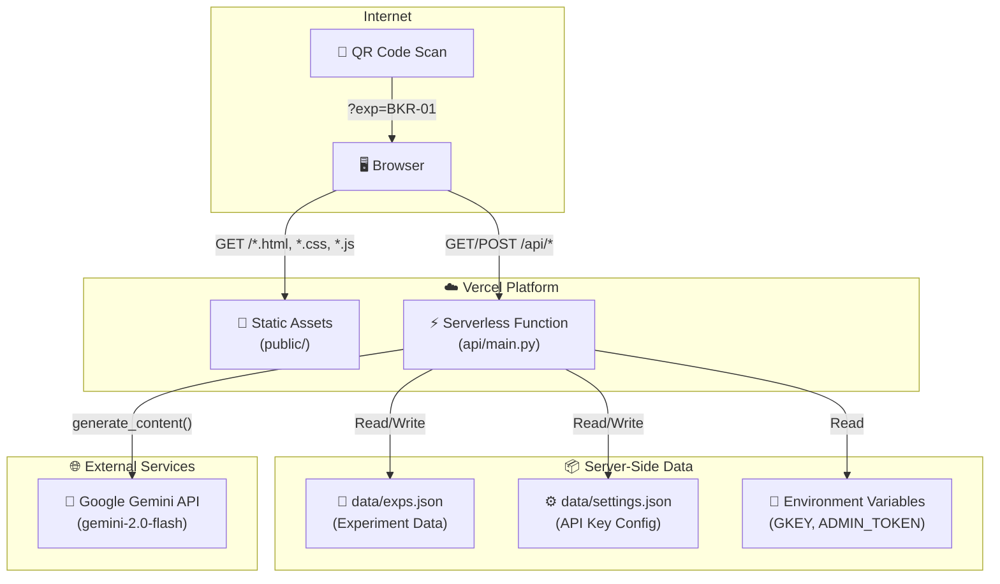
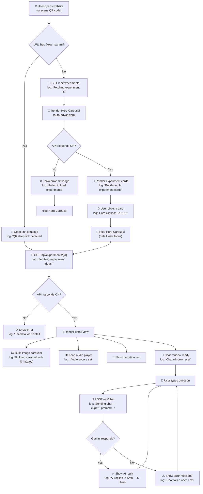
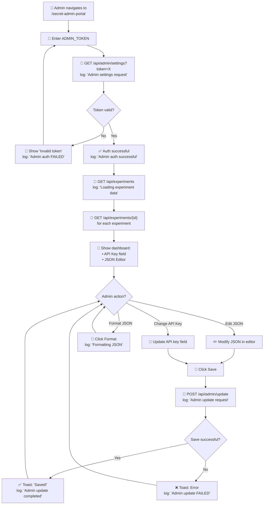
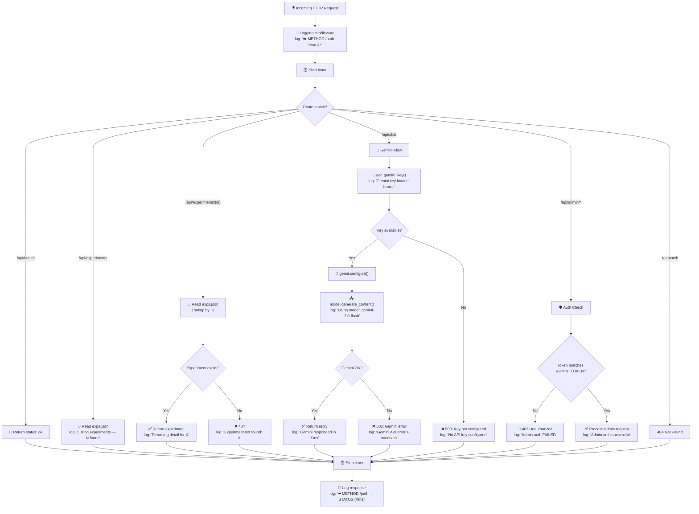
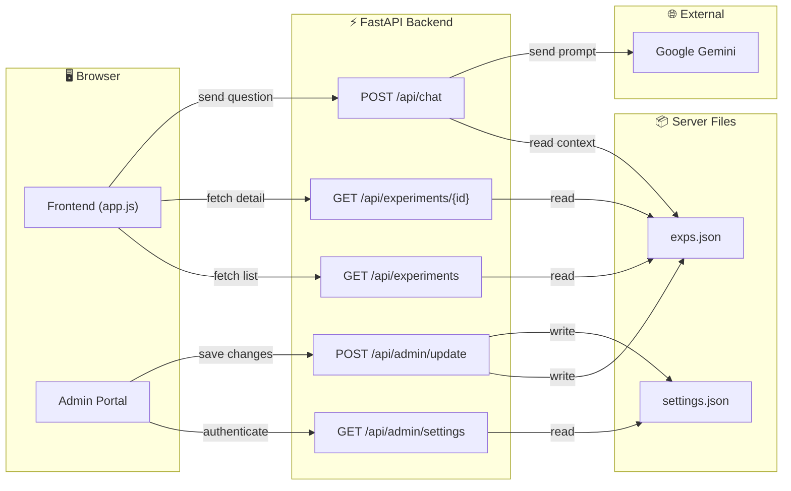
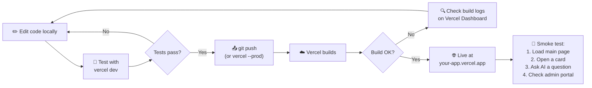

# POC AI Lab — Developer Workflow & Handover Guide

> **Audience:** Developers taking over maintenance of this project.  
> **Last Updated:** March 2026

---

## 1. System Overview Flowchart



---

## 2. Public User Flow

This is what happens when a **student or visitor** uses the site.



---

## 3. Admin Workflow

This is how the **admin** manages data and settings.



---

## 4. Backend Request Lifecycle

Every single HTTP request goes through this pipeline:



---

## 5. Data Flow Diagram

Shows how data moves between components:



---

## 6. File Change Impact Matrix

Use this to understand what to check when you modify a file:

| File Modified | What It Affects | What to Test |
|---|---|---|
| `data/exps.json` | All experiment cards, detail pages, chat context | Refresh main page, check each experiment detail |
| `data/settings.json` | Gemini API key used for chat | Test chat — send a question |
| `api/main.py` | All API endpoints | Run `uvicorn`, hit each endpoint |
| `public/index.html` | Page structure, layout | Visual check in browser |
| `public/style.css` | All visual styling | Visual check — cards, chat, carousels (hero & detail) |
| `public/app.js` | All frontend behavior | Click cards, use carousels (hero class), chat |
| `public/images/` | Hero carousel assets | Verify image links in app.js initHeroCarousel() |
| `public/admin_5502.html` | Admin portal only | Go to `/secret-admin-portal`, login, edit, save |
| `vercel.json` | Routing, deployment | Deploy to Vercel, check all routes |
| `.env` | API keys, admin token | Restart server, test auth and chat |
| `requirements.txt` | Backend dependencies | `pip install -r requirements.txt` |

---

## 7. Log Reference Table

### Backend Logs (Python — `api/main.py`)

| Emoji | Category | Example Log | When It Fires |
|---|---|---|---|
| 🚀 | Startup | `POC AI Lab backend starting up` | Server boots |
| ✅ | Success | `Startup complete — 12 experiments loaded` | After init |
| ➡️ | Request In | `GET /api/experiments from 192.168.1.1` | Every HTTP request |
| ⬅️ | Response Out | `GET /api/experiments → 200 (45ms)` | Every HTTP response |
| 📋 | List | `Listing experiments — 12 found` | GET /api/experiments |
| 🔍 | Detail | `Fetching experiment detail: BKR-01` | GET /api/experiments/{id} |
| 💬 | Chat | `Chat request — exp=BKR-01, prompt_length=42` | POST /api/chat |
| 🤖 | Gemini | `Gemini responded in 1200ms — 350 chars` | After Gemini reply |
| 🔑 | API Key | `Gemini key loaded from settings.json` | On each chat request |
| 🛡️ | Auth | `Admin settings request` | Admin endpoint hit |
| 🚫 | Auth Fail | `Admin auth FAILED — invalid token` | Wrong token |
| 💾 | Write | `Wrote data/exps.json (6455 bytes)` | Admin save |
| 📄 | Read | `Read data/exps.json — 12 top-level keys` | Any file read |
| 🔒 | Permission | `Permission denied — filesystem read-only` | Vercel write attempt |
| 💥 | Error | `Gemini API error after 500ms: ...` | Any exception |
| 🛑 | Shutdown | `Shutting down POC AI Lab backend` | Server stops |

### Frontend Logs (JavaScript — `app.js`)

| Emoji | Category | Example Log | Where to See |
|---|---|---|---|
| ℹ️ | Info | `App script loaded — initializing…` | Browser Console |
| 🌐 | Network | `→ GET /api/experiments` | Browser Console |
| 🌐 | Network | `← GET /api/experiments → 200 (120ms)` | Browser Console |
| 🎨 | UI | `Rendering 12 experiment cards` | Browser Console |
| 🎨 | UI | `Carousel built and ready` | Browser Console |
| 💬 | Chat | `Sending chat — exp=BKR-01...` | Browser Console |
| ✅ | Success | `AI replied in 1500ms — 300 chars` | Browser Console |
| ⚠️ | Warning | `Carousel image failed to load: URL` | Browser Console |
| ❌ | Error | `Failed to load experiments: ...` | Browser Console |
| 🔗 | Deep Link | `QR deep-link detected: exp=BKR-01` | Browser Console |
| 🐛 | Debug | `Carousel slide: 2/3` | Browser Console |

### Admin Logs (JavaScript — `admin_5502.html`)

| Emoji | Category | Example Log | When |
|---|---|---|---|
| 🔐 | Login | `Login attempt…` | Token submitted |
| ✅ | Auth | `Authentication successful` | Valid token |
| 🚫 | Auth | `Login FAILED — invalid token` | Wrong token |
| 📋 | Load | `Found 12 experiments — fetching…` | After login |
| 💾 | Save | `Save initiated…` | Save button clicked |
| 📄 | Parse | `JSON parsed — 12 entries` | Before save |
| 🔧 | Format | `Formatting JSON…` | Format clicked |
| 🍞 | Toast | `Toast [success]: Saved!` | Any notification |

---

## 8. Common Maintenance Scenarios

### Scenario 1: Add a New Experiment
```
1. Open Admin Portal → /secret-admin-portal
2. Login with ADMIN_TOKEN
3. In JSON editor, add a new entry like "BKR-13": { ... }
4. Upload the audio .mp3 to public/audio/
5. Click Save
6. Verify: Check backend logs for "💾 Wrote data/exps.json"
7. Verify: Refresh main page — new card should appear
```

### Scenario 2: Gemini Stops Responding
```
1. Check backend logs for "💥 Gemini API error"
2. Check if API key is valid → Admin Portal → check key field
3. Check Google Cloud Console for API quota/billing
4. Look for: "🔑 No Gemini API key found" in logs
5. If key expired → update via Admin Portal or Vercel env vars
```

### Scenario 3: Images Not Loading
```
1. Check frontend console for "⚠️ Carousel image failed to load: URL"
2. Open the image URL directly in browser — is it a dead link?
3. If dead → update image URLs in exps.json via Admin Portal
4. If CORS issue → images need to be from a CORS-enabled server
```

### Scenario 4: Admin Cannot Login
```
1. Check backend logs for "🚫 Admin auth FAILED"
2. Verify ADMIN_TOKEN in .env (local) or Vercel Dashboard (prod)
3. Make sure no leading/trailing spaces in the token
4. On Vercel: check Environment Variables → Redeploy after changes
```

### Scenario 5: Changes Not Persisting on Vercel
```
1. This is EXPECTED — Vercel has a read-only filesystem
2. Backend log will show: "🔒 Permission denied — filesystem read-only"
3. Solution A: Update env vars in Vercel Dashboard → Redeploy
4. Solution B: Integrate a database (Vercel KV, Redis, MongoDB)
5. For file changes: edit locally → git push → redeploy
```

---

## 9. Deployment Pipeline



---

## 10. Quick Command Reference

| Task | Command |
|---|---|
| Start local server | `.\.venv\Scripts\Activate; uvicorn api.main:app --reload --port 8000` |
| Start with Vercel emulation | `vercel dev` |
| Install dependencies | `.\.venv\Scripts\pip install -r requirements.txt` |
| Deploy to Vercel | `vercel --prod` |
| View backend logs (local) | Logs print directly to terminal |
| View frontend logs | Browser → F12 → Console → filter `[POC-AI-LAB]` |
| View admin logs | Browser → F12 → Console → filter `[ADMIN]` |
| Check API health | `curl http://localhost:8000/api/health` |
